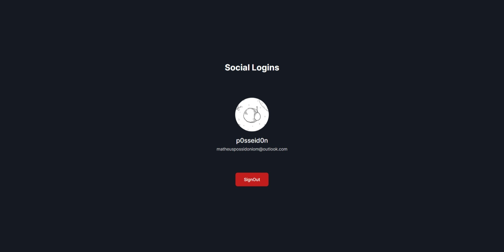

# Social Logins Using Supabase

Projeto de Login com redes sociais usando Supabase.




```bash
# Clone o repositório
$ git clone https://github.com/P0sseid0n/Social-Logins-With-Supabase.git

# Va para o repositório
$ cd SocialLoginsWithSupabase

# Instale as dependências
$ npm install

# Rode a aplicação em modo de desenvolvimento
$ npm run dev
```

## Contribution 🤝

Contribuições são bem-vindas! Se você tiver sugestões, correções de bugs ou melhorias para o projeto, sinta-se à vontade para abrir uma solicitação de pull.

## License 📄

Este projeto está licenciado sob a [MIT License](./LICENSE.md).
